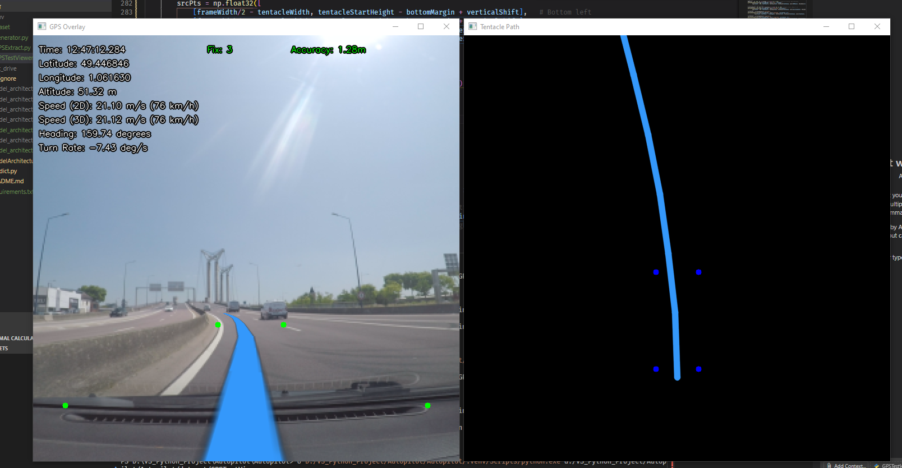
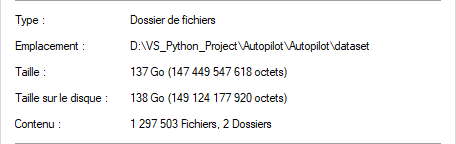
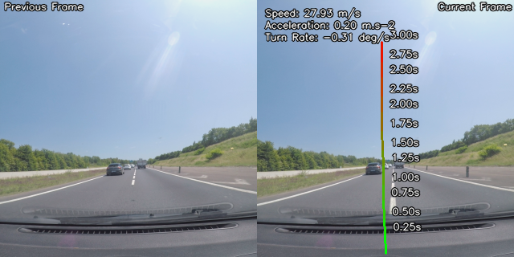
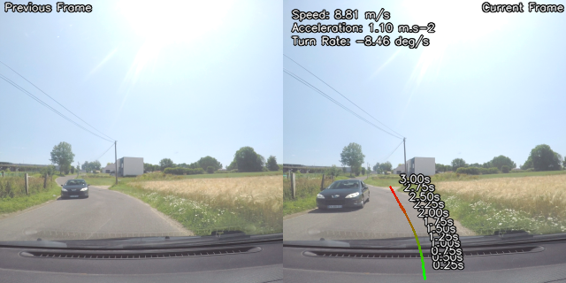
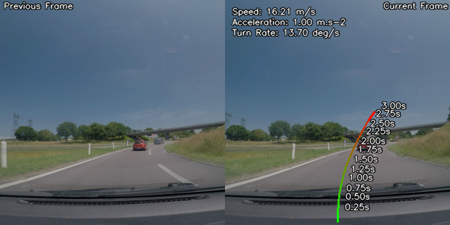
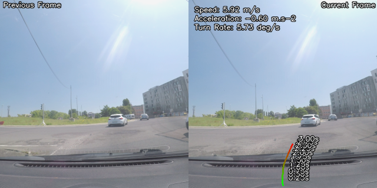
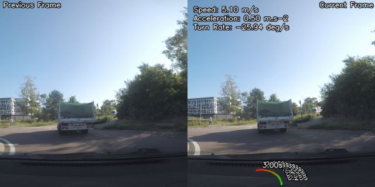
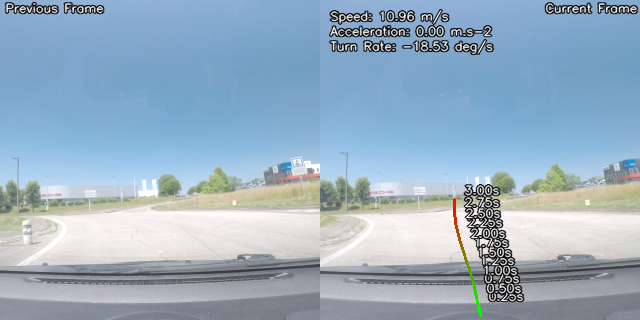
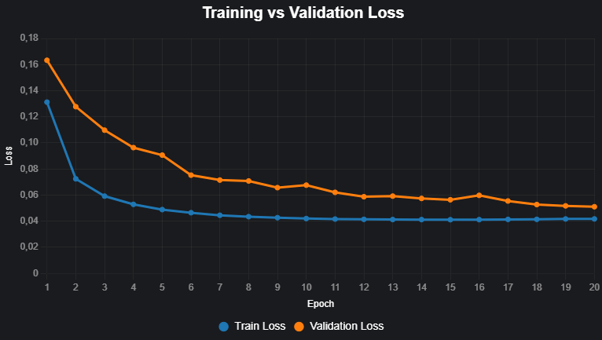
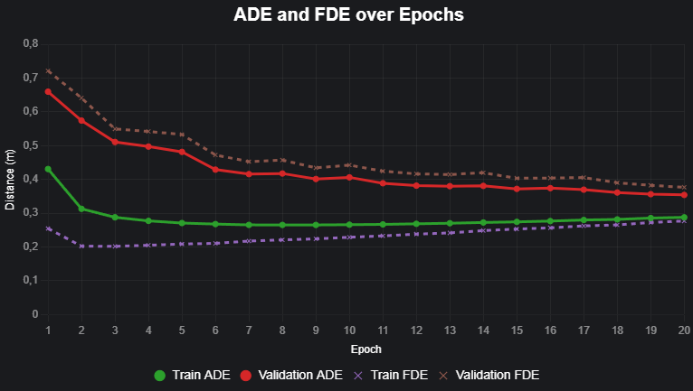

# Custom Multi-Modal

An advanced vehicle trajectory prediction system leveraging deep learning to forecast vehicle path over a 3-second horizon based on visual input and GPS data.

## Overview

This project implements a multi-modal network that predicts the future trajectory of the vehicle using:
- 2 RGB images from a front-facing GoPro camera (480x270 pixels, both images are separated by a 0.1s time interval for temporal context)
- Vehicle speed (m/s) derived from GPS data

The model outputs 6 two-dimensional vectors representing the predicted travel path (x, y) in the 2D road plane over a 3-second interval.

## Data Visualization

The following visualization shows an example of processed GPS data used for training and evaluation:

## Model Architecture

The network uses an early fusion encoder-decoder architecture that processes two consecutive RGB images concatenated as input, followed by an attentive GRU decoder for trajectory prediction:

- **Early Fusion Encoder**: Concatenates the two input images (6 channels) and processes them through hierarchical convolutional layers with residual connections
- **Attentive GRU Decoder**: Uses spatial attention to focus on relevant image regions while autoregressively predicting displacement vectors

Detailed architecture documentation can be found in:
- [LaTeX description](model/architecture/model_architecture.tex)
- [Mermaid diagram](model/architecture/modelArchitecture.mmd)

To generate a PDF from the LaTeX file, compile `model_architecture.tex` with a LaTeX distribution (e.g., using pdflatex).

## Dataset

The dataset consists of processed frames from .mp4 video files captured with a GoPro Hero 5 camera, paired its GPS data. The data generation process involves:

1. Extracting GPS data (position, speed, timestamps) from the GoPro's metadata
2. Processing video frames at specific intervals (480x270 pixel resolution)
3. For each frame pair:
   - Two consecutive frames separated by 0.1 seconds are extracted
   - GPS data is validated for accuracy (fix type 3* and accuracy < 3.0m)
   - Future trajectory vectors are calculated for the next 3 seconds
   - Random adjustments to exposure, gamma, brightness, and contrast are applied for a better generalization (hopefully)

The generated dataset is over 130Go with 432501 datapoints.

*fix type 3 means the GPS has a 3D fix, which is the most accurate fix type available. The accuracy threshold of < 3.0m ensures that the GPS data is reliable for trajectory prediction, tho even with this fix type GPS data can still be inacurate.*

*Filtering based on map data could be a potential improvement for the dataset quality.*

### Example Scenarios

| Lane Changes | Left Turns | Right Turns |
|:---:|:---:|:---:|
|  |  |  |

| Roundabout Entry | In Roundabout | Roundabout Exit |
|:---:|:---:|:---:|
|  |  |  |

Each sample in the dataset includes the image pair, current speed, and the ground truth trajectory vectors representing the vehicle's future path.

## Training

### Current run in training: **run13**
100 hours of training as of now at epoch 20.

The new architecture reduced parameters from 23M to 8.8M while achieving better performance at equivalent training time.

Check out a video demonstration of the model in action (at epoch 19):

<a href="https://x.com/THEAYPISAMFPV/status/1982888965666681123">View the video demonstration on X</a>

## Q&A

### Will the model's weights be available?

**No**, i'm not planning on releasing them for now (they are shitty anyway). If a good model is trained, then i'll consider it.

### How can I help?
By sending me a better GPU for AI training then an rtx2060 6G, thanks :)