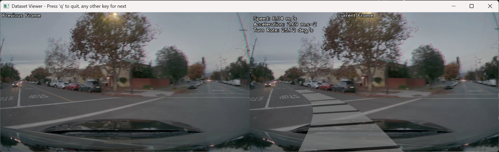
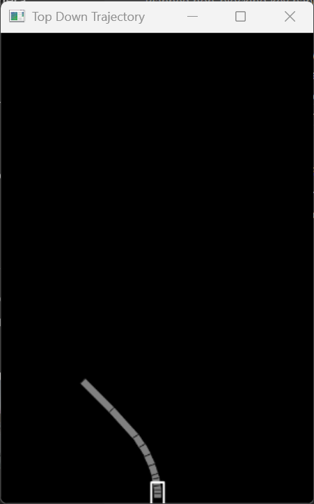
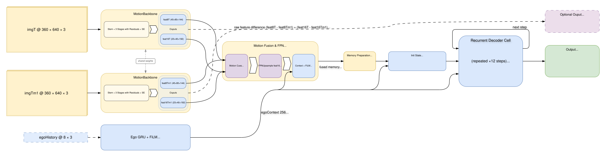
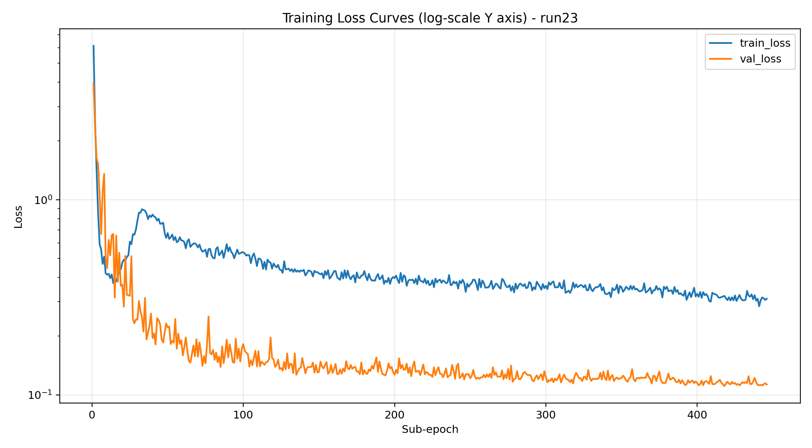
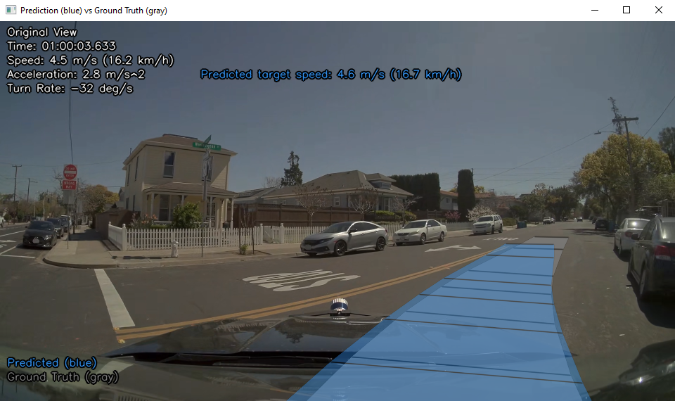
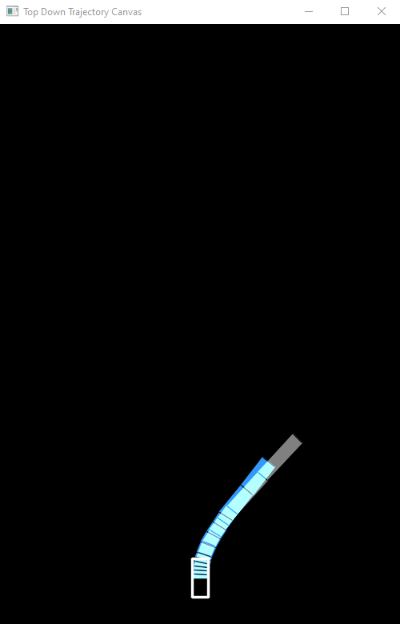
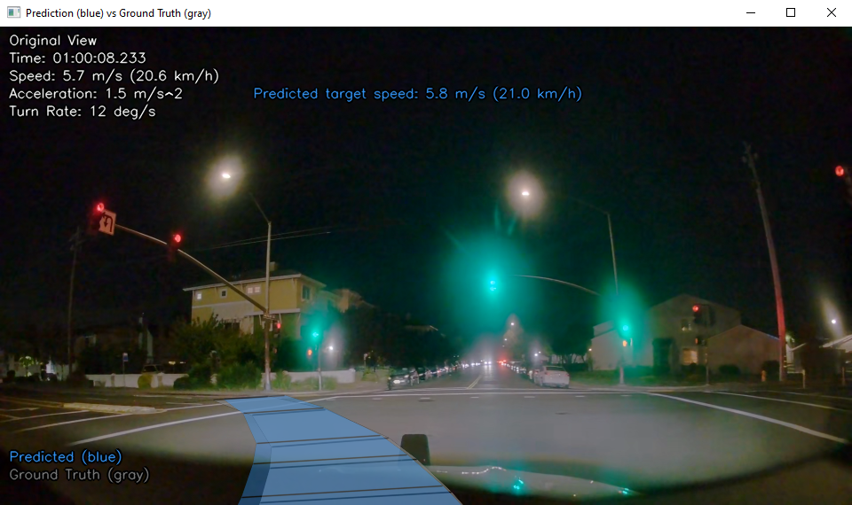
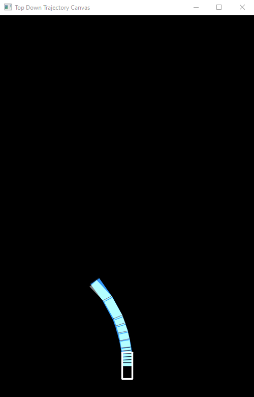

# Vision-Only ADAS Trajectory Prediction (Current Model)

Vision-based ego-trajectory prediction from two consecutive front-camera frames, with optional ego-history context and a non-uniform 3-second prediction horizon.

Last updated: 2026-04-14.

## Current Model Snapshot

- Main model class: `TrajectoryModel` (thin wrapper subclass of `SmoothKinematicTrajectoryModel` in `model/CreateModel.py`).
- Runtime model name: `TrajectoryModel_MotionFpn_CrossAttentionKinematic_V2`.
- Model input: two RGB frames `(360x640)` separated by approximately 0.1 s, plus optional ego-history `(B, 8, 3)`.
- Model output: 12 future kinematic states `(speed_mps, yawRate_radps)`.
- Horizon times (`vectorTimes`): `[0.1, 0.2, 0.3, 0.4, 0.5, 0.6, 0.85, 1.1, 1.35, 1.6, 2.3, 3.0]`.
- Current run folder in this repository: `training/run23`.

## Repository Layout (High Level)

- `dataset/`: NVIDIA dataset generation, balancing, and visualization utilities.
- `model/`: model architecture definitions and training implementation.
- `training/`: run artifacts (`training_params.json`, history CSV, checkpoints, plots).
- `test_drive/`: inference videos and telemetry JSON files.
- `ADS presentation/`: diagrams and report material.
- Top-level scripts:
  - `runTraining.py`: scheduler-aware training wrapper.
  - `runModel.py`: inference and visualization.
  - `runInvertedModel.py`: trajectory-conditioned frame inversion utility.

## Data Visualization

Examples of processed trajectory labels projected from the NVIDIA PhysicalAI-Autonomous-Vehicles pose stream:

| Frames View | Top-Down |
|:---:|:---:|
|  |  |

## Model Architecture



Core blocks:

1. MotionBackbone (shared weights on frame `t` and `t-1`)
2. MotionFpnEncoder
3. EgoStateEncoder (GRU on 8-step ego-history)
4. CrossAttentionDeltaKinematicDecoder

Technical details:

- Temporal fusion is built from `[feat_t, feat_t-1, feat_t - feat_t-1]` at two scales, then fused with an FPN-style merge.
- Normalized x/y coordinate channels are appended before decoding.
- Decoder performs per-step cross-attention over spatial memory.
- Decoder predicts delta updates and accumulates state autoregressively.
- Teacher forcing is one-step lagged to avoid current-step label leakage.
- Ego-context dropout (`egoDropoutProb=0.15`) is used during training to reduce ego-only shortcut behavior.

Trajectory integration used by training and inference utilities:

$$
\psi_t = \psi_{t-1} + \dot{\psi}_t\,\Delta t_t
$$

$$
x_t = x_{t-1} + v_t\sin(\psi_t)\,\Delta t_t, \qquad
y_t = y_{t-1} + v_t\cos(\psi_t)\,\Delta t_t
$$

## Dataset Pipeline (NVIDIA)

Source: https://huggingface.co/datasets/nvidia/PhysicalAI-Autonomous-Vehicles

Implemented in `dataset/generator.py` via `generateDatasetNvidiaClip`:

1. Read camera frames and timestamp parquet.
2. Read egomotion parquet.
3. Build frame pairs with temporal context (default 0.1 s).
4. Interpolate ego-state values at target timestamps.
5. Convert world motion to local incremental vectors (`x=right`, `y=forward`).
6. Save labels (and optionally images).

`labelsOnly=True` is supported. In that mode, labels store video path and frame indices, and `model/train.py` reconstructs frames from source videos on demand.

Label file format:

```text
vectors : x1,y1 x2,y2 ...
vectorTimes : t1 t2 ...
speed : ...
acceleration : ...
turnRate : ...
video : ...                 # only in labels-only mode
prevFrameIndex : ...        # only in labels-only mode
frameIndex : ...            # only in labels-only mode
```

### Dataset Balancing

`dataset/datasetBalancer.py` builds `balanced.json` with class buckets:

- `straight`
- `left`
- `right`
- `s`
- `still`

`model/train.py` automatically consumes `balanced.json` when present.

## Training

Two training entry points are used:

1. `runTraining.py` (scheduler wrapper)
2. `model/train.py` (direct entry)

`runTraining.py` supports scheduled pauses. Current defaults pause training on weekdays between 07:30 and 17:30, release resources, then resume automatically.

### Current Training Behavior

- Clip-aware train/validation split.
- Sub-epoch schedule (`computeCleanSubepochSchedule`) for long-running control.
- AMP enabled when CUDA is available.
- Teacher forcing ratio decays from 0.9 to 0.0 over the first 30 sub-epochs.
- Kinematic loss combines weighted SmoothL1, integration consistency, and jerk penalty.
- Saves `training_params.json`, `training_history.csv`, `best_model.pth`, and `last_model.pth`.

### Recorded Run Configuration (run23)

From `training/run23/training_params.json`:

- `batchSize=24`
- `gradAccumSteps=1`
- `trainSamplesPerEpoch=8000`
- `valSamplesPerEpoch=16000`
- `predSteps=12`
- `vectorTimes=[0.1, ..., 3.0]`
- `modelName=TrajectoryModel_MotionFpn_CrossAttentionKinematic_V2`

### Performances (run23)

### Loss Curves


#### Prediction Visualization

| Front Facing Camera | Top-Down |
|:---:|:---:|
|  |  |
|  |  |

## Inference and Visualization

### runModel.py

- Loads checkpoint and `training_params.json`.
- Supports NVIDIA clip mode.
- Projects trajectories in camera fisheye space and top-down space.
- Can display attention and motion-map overlays.

Keyboard controls:

- `q`: quit
- `v`: cycle views (original, model input, attention, motion-encoder)
- `j` / `l`: previous/next attention step in attention view

### runInvertedModel.py

Frame inversion utility that optimizes image pixels to match a target trajectory using:

- reconstruction loss
- total variation loss
- temporal consistency loss

## Setup

Install dependencies:

```bash
pip install -r requirements.txt
```

Most scripts use hardcoded local paths in their `__main__` blocks. Edit those constants before running.

### Quick Start

1. Set dataset and checkpoint paths in `runTraining.py`.
2. Start training:

```bash
python runTraining.py
```

3. Set `modelPath`, `videoPath`, and `calibrationRoot` in `runModel.py`.
4. Run inference and visualization:

```bash
python runModel.py
```

5. Optional inversion workflow:

```bash
python runInvertedModel.py
```

### Path Configuration Checklist

- `runTraining.py`
  - `datasetPath`
  - `resumeModelPath`
- `runModel.py`
  - `modelPath`
  - `videoPath`
  - `calibrationRoot`
- `runInvertedModel.py`
  - `modelPath`
  - `videoPath`
  - `calibrationRoot`

## Developer Compatibility Note

When extending `runModel.py`, keep the current `calculateFutureTrajectoryEgomotion` call signature from `dataset/generator.py`:

```python
calculateFutureTrajectoryEgomotion(egoData, currentTimeUs, targetTimesUs)
```

Do not use the `steps=` keyword.

## License and Sharing Constraints

Read `LEGAL.md` before sharing project outputs.

Due to the NVIDIA PhysicalAI-Autonomous-Vehicles license agreement, model weights and precise quantitative results are not shared publicly.
