# Vision-Only Autonomous Vehicle model

A vision-only motion-aware CNN planner that uses two consecutive front-camera frames and forecasts future vehicle motion over an ~3-second horizon using non-uniform `vectorTimes`.

(legacy Early Fusion + Attentive GRU model shown above; the current main model is a motion-FPN cross-attention kinematic planner)

## Overview

This project implements a vision-based network that predicts the future motion of the vehicle from:
- Two RGB frames from a front-facing camera (360x640, separated by 0.1s for temporal context)

The current model predicts 12 future kinematic states `[signed_speed_mps, yaw_rate_radps]` over a 3-second interval and integrates them into the travel path in the vehicle frame. The prediction horizon uses a non-uniform timing schedule (0.1s x 6, 0.25s x 4, 0.7s x 2).

## Data Visualization

The following visualization shows examples of processed pose-derived trajectory data from the NVIDIA PhysicalAI-Autonomous-Vehicles dataset used for training and evaluation:

| Frames View | Top-Down |
|:---:|:---:|
|  |  |

## Model Architecture

The network uses a motion-aware encoder with a cross-attention recurrent planner:

- **Motion Backbone + FPN Fusion**: Two shared CNN backbones extract multi-scale features from the current and previous frames. Per-scale features are concatenated with their temporal differences, fused through 1x1 convolutions, and combined with a top-down FPN-style merge.

- **Spatial Coordinate Channels**: Normalized `x`/`y` frame-space coordinate channels are appended to the fused feature map to provide explicit spatial context.

- **Cross-Attention Kinematic Decoder**: A recurrent decoder predicts future signed speed and yaw-rate deltas while re-attending to the fused image memory at every step. Each step is conditioned on ego-state context, the previous predicted state, and the non-uniform time offset embedding.

- **Per-Step Attention Maps**: The planner exposes cross-attention maps that show where each rollout step is reading from the visual memory.

- **Ego Shortcut Regularization**: During training, the ego-state context is randomly dropped on some batches so the planner stays visually grounded instead of over-relying on past-motion extrapolation.

By default, the model predicts 12 future states over a 3-second horizon with a non-uniform timing schedule (0.1s x 6, 0.25s x 4, 0.7s x 2). You can override `vectorTimes` at runtime. *(Model is in training; changing `vectorTimes` may affect performance.)*

## Dataset

### New way (NVIDIA PhysicalAI-Autonomous-Vehicles)

The current dataset used is NVIDIA’s PhysicalAI-Autonomous-Vehicles dataset:
*https://huggingface.co/datasets/nvidia/PhysicalAI-Autonomous-Vehicles*

The data generation process for this dataset is similar in spirit to the old GoPro pipeline, but uses the dataset's per-frame ego-pose and timestamps to build the trajectory labels:

1. Sample consecutive RGB frames separated by 0.1s (same as the model input).
2. Read the ego vehicle pose for each frame (position + orientation) from the dataset.
3. For each input pair, collect future ego poses over the next 3 seconds.
4. Convert those future poses into local displacements relative to the current frame (vehicle-centric x/y).
5. Downsample or resample to 12 vectors using the non-uniform timing schedule (0.1s x 6, 0.25s x 4, 0.7s x 2).

This produces the same kind of 12-step (x, y) displacement targets the model expects, but derived from the dataset's provided pose stream instead of GPS.

#### **License/Terms of Use**
This dataset is governed by the NVIDIA Autonomous Vehicle Dataset License Agreement. This means that i can't share any statistics or details about how models trained on this dataset perform, sorry :/
you can find more details about the license here:
*https://huggingface.co/datasets/nvidia/PhysicalAI-Autonomous-Vehicles/blob/main/LICENSE.pdf*.

### Old way (GoPro with GPS)

The original dataset consisted of processed frames from .mp4 video files captured with a GoPro Hero 5, paired with its GPS data. The data generation process involves:

1. Extracting GPS data (position, speed, timestamps) from the GoPro's metadata
2. Processing video frames at specific intervals (640x360 pixel resolution)
3. For each frame pair:
   - Two consecutive frames separated by 0.1 seconds are extracted
   - GPS data is validated for accuracy (fix type 3* and accuracy < 3.0m)
   - Future trajectory vectors are calculated for the next 3 seconds
   - Random adjustments to exposure, gamma, brightness, and contrast are applied for a better generalization (hopefully)

The generated dataset is over 130Go with 432501 datapoints.

*fix type 3 means the GPS has a 3D fix, which is the most accurate fix type available. The accuracy threshold of < 3.0m ensures that the GPS data is reliable for trajectory prediction, tho even with this fix type GPS data can still be inacurate.*

*Filtering based on map data could be a potential improvement for the dataset quality.*

### Example Scenarios

| Lane Changes | Left Turns | Right Turns |
|:---:|:---:|:---:|
|  |  |  |

| Roundabout Entry | In Roundabout | Roundabout Exit |
|:---:|:---:|:---:|
|  |  |  |

Each sample in the dataset includes the image pair and the ground truth trajectory vectors representing the vehicle's future path. Training converts those vectors into per-step signed speed and yaw-rate targets for the current model. (Legacy records may include speed metadata, but the current model is vision-only.)

## Training

### Current run in training: **run21**
Run21 used the previous motion-FPN model generation. The current main architecture in code is `TrajectoryModel_MotionFpn_CrossAttentionKinematic_V2`.

### Latest working model: **run13**
The latest model that achieved good performance is `TrajectoryModel_EarlyFusion_AttentiveGRU`.

Here are the training curves for run13:

- ***ADE** (Average Displacement Error) is the mean L2 distance between predicted and ground-truth points across all time steps.*

- ***FDE** (Final Displacement Error) is the L2 distance at the final predicted step.*

Check out a legacy video demonstration of the model in action (at epoch 19):

## Q&A

### Will the model's weights be available?

**No**, I am not planning to release them for now.

### How can I help?
By sending me a better GPU for AI training than an RTX 2060 6G, thanks :)
