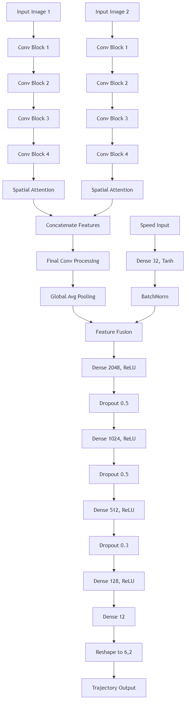
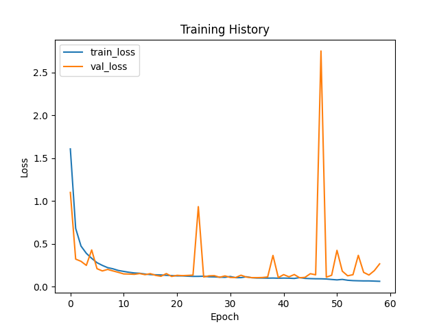

# Custom Multi-Modal

An advanced vehicle trajectory prediction system leveraging deep learning to forecast vehicle path over a 3-second horizon based on visual input and GPS data.

## Overview

This project implements a multi-modal network that predicts the future trajectory of the vehicle using:
- 2 RGB images from a front-facing GoPro camera (480x270 pixels, both images are separated by a 0.1s time interval for temporal context)
- Vehicle speed (m/s) derived from GPS data

The model outputs 6 two-dimensional vectors representing the predicted travel path (x, y) in the 2D road plane over a 3-second interval.

## Data Visualization

The following visualization shows an example of processed GPS data used for training and evaluation:

## Model Architecture

The network uses a multi-modal input approach with two processing branches that are fused to make accurate trajectory predictions:

PDF version of the architecture diagram can be found [here](model/architecture/model_architecture.pdf).

## Dataset

The dataset consists of processed frames from .mp4 video files captured with a GoPro Hero 5 camera, paired its GPS data. The data generation process involves:

1. Extracting GPS data (position, speed, timestamps) from the GoPro's metadata
2. Processing video frames at specific intervals (480x270 pixel resolution)
3. For each frame pair:
   - Two consecutive frames separated by 0.1 seconds are extracted
   - GPS data is validated for accuracy (fix type 3* and accuracy < 3.0m)
   - Future trajectory vectors are calculated for the next 3 seconds
   - Random adjustments to exposure, gamma, brightness, and contrast are applied for a better generalization (hopefully)

The generated dataset is over 130Go with 432501 datapoints.

*fix type 3 means the GPS has a 3D fix, which is the most accurate fix type available. The accuracy threshold of < 3.0m ensures that the GPS data is reliable for trajectory prediction, tho even with this fix type GPS data can still be inacurate.*

*Filtering based on map data could be a potential improvement for the dataset quality.*

### Example Scenarios

| Lane Changes | Left Turns | Right Turns |
|:---:|:---:|:---:|
|  |  |  |

| Roundabout Entry | In Roundabout | Roundabout Exit |
|:---:|:---:|:---:|
|  |  |  |

Each sample in the dataset includes the image pair, current speed, and the ground truth trajectory vectors representing the vehicle's future path.

## Training

### Current run in training: **run10**
Updated parameters count from 17M to 23M, with an improved image processing and fully connected layers.

### Latest trained run: **run9**

10 days of training, for... garbage, val loss is low, but the generalization is bad

(only the model with the lowest val loss is saved obviously)

## Q&A

### Will the model's weights be available?

**No**, i'm not planning on releasing them for now (they are shitty anyway). If a good model is trained, then i'll consider it.

### How can I help?
By sending a a better GPU for AI training then an rtx2060 6G, thanks :)